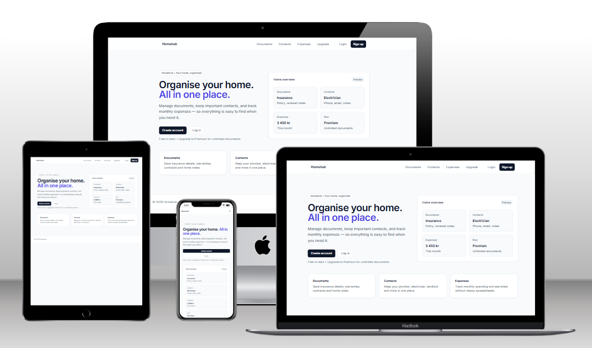
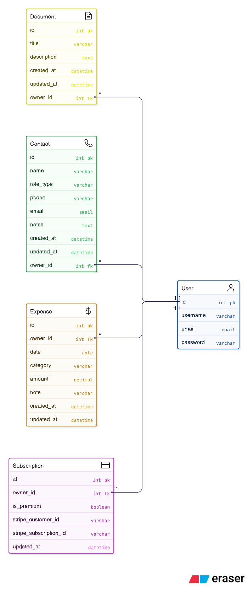

# Homehub 🏡

**Homehub** is a full-stack Django web application designed to help users organize important home information in one place. Users can securely log in to manage **documents**, **contacts**, and **monthly expenses**, and optionally upgrade to **Premium** via Stripe to unlock unlimited document storage.

[Live Demo](https://homehub-anton-5399ce3434e0.herokuapp.com/)

---

## Key Features

- User authentication (registration, login, logout)
- Clean Tailwind UI (Notion-inspired)
- Documents:
  - Create / view / edit / delete
  - Search functionality
  - Free plan document limit (Premium removes the limit)
- Contacts:
  - Store home-related contacts (plumber, electrician, landlord etc.)
  - Full CRUD + search
- Expenses:
  - Monthly expense tracking
  - Month filter + monthly totals
- Payments:
  - Stripe checkout (test mode)
  - Premium status enabled after successful payment
- Feedback messages and confirmation flows
- Responsive design (mobile, tablet, desktop)

## Contents

1. [Features](#features)
2. [User Experience (UX)](#user-experience-ux)
   - [Design Choices](#design-choices)
   - [Typography](#typography)
   - [User Stories](#user-stories)
   - [Wireframes](#wireframes)
3. [Information Architecture](#information-architecture)
   - [Database Schema Diagram](#database-schema-diagram)
4. [Technologies Used](#technologies-used)
5. [Agile Methodology](#agile-methodology)
   - [Kanban Workflow](#kanban-workflow)
   - [Project Evolution](#project-evolution)
6. [Version Control](#version-control)
7. [Deployment](#deployment)
8. [Testing](#testing)
9. [Known Issues and Future Features](#known-issues-and-future-features)
10. [Credits](#credits)
    - [Resources Used](#resources-used)
    - [Code Used](#code-used)
    - [Acknowledgements](#acknowledgements)

---
## Features

### Existing Features

1. **User Registration & Authentication**
   - Secure signup, login, logout
   - User data is private (users can only access their own content)

2. **Documents Management**
   - Add, edit, view, and delete documents
   - Search documents by title and description
   - Free plan document limit (Premium removes the limit)

3. **Contacts Management**
   - Add, edit, and delete contacts
   - Store key household contacts (e.g. electrician, plumber)
   - Search contacts by name, role, or notes

4. **Expenses Tracking**
   - Add, edit, and delete expenses
   - Filter expenses by month
   - Monthly totals displayed clearly

5. **Payments & Subscription**
   - Upgrade to Premium through Stripe Checkout
   - Premium status displayed across the UI
   - Premium removes free plan document limit

6. **Admin Panel**
   - Django admin for user and content management

[Go to Contents](#contents)

---

## Project Goals
### Business Goals
- Provide a simple, intuitive platform to store home information securely.
- Encourage upgrades by offering a meaningful Premium benefit (increased document capacity).

### User Goals
- Store and find home documents quickly.
- Maintain a reliable list of home-related contacts.
- Track expenses by month and see totals.
- Upgrade to Premium with clear purchase feedback.

---

## Target Audience
- Home owners and renters who want one place for home information.
- Families managing recurring household costs and services.
- Users who want a lightweight “home admin” tool that is easy to use.

---

## User Experience (UX)

### Design Choices

Homehub is designed as a clean digital home organizer with a calm, minimal interface inspired by productivity tools.

#### Color Scheme
- Neutral base with subtle borders and soft backgrounds
- Accent color used for primary actions and navigation focus

> Add screenshot:
`readme_assets/images/color_palette.png`

#### Typography
- Clean typography for readability (modern sans-serif / Inter-like)
- Clear hierarchy for headings, labels, and helper text

#### User Stories

##### Visitors
- As a visitor, I can view the landing page but cannot access private content.

##### Registered Users
- As a user, I can register an account.
- As a user, I can log in and log out securely.
- As a user, I can create, edit and delete my own documents.
- As a user, I can store key contacts for my household.
- As a user, I can track monthly household expenses.
- As a user, I receive confirmation messages when actions succeed or fail.
- As a user, I can upgrade to Premium to unlock unlimited documents.

##### Admin Users
- As an admin, I can manage users and data via Django admin.

#### Wireframes

Landing Page

 

Dashboard

 

Documents

 

Wireframes were created using (Figma / Visily.ai).

[Go to Contents](#contents)

---

## Information Architecture

### Database Schema Diagram

Homehub uses a user-owned content model:
- Each user can have many documents, contacts, and expenses.
- Each record belongs to one user.
- Premium state is stored in a subscription model linked to the user.

[Go to Contents](#contents)

---

## Technologies Used

### Languages and Frameworks

- 
- 
- 
- 
- 

### Databases

-  (production)

### Other Tools

- 
- 
- 
- 
- 
- 
- 
- 
- 
- 
- 

[Go to Contents](#contents)

---

## Agile Methodology

This project was developed using Agile methodology and tracked using GitHub Issues / Projects.

### Kanban Workflow
> Add your board link here:
- Kanban Board: `https://github.com/users/carlssonanton87/projects/<ID>`

### Project Evolution
- Planned epics and user stories first
- Implemented core CRUD functionality
- Added Premium subscription gate (Stripe)
- Iterated UI/UX with Tailwind and responsive improvements
- Deployed to Heroku with auto-deploy from GitHub

[Go to Contents](#contents)

---

## Version Control

For version control, Git was used to track changes through frequent commits:

- `git add .`
- `git commit -m "message"`
- `git push`

[Go to Contents](#contents)

---

## Security
- Authentication is required for all user data features.
- Owner-only permissions are enforced by filtering objects by `owner=request.user`.
- Sensitive configuration (SECRET_KEY, Stripe keys) is stored in environment variables.
- Production settings disable DEBUG and use ALLOWED_HOSTS from the environment.
- POST is used for logout and payments to reduce CSRF risk.

---

## Technologies Used
- Python / Django
- HTML / CSS
- SQLite (development)
- PostgreSQL (production)
- Stripe (payments)
- Gunicorn (production server)
- Whitenoise (static file serving)
- Git / GitHub (version control)

---

## Testing
Automated tests are implemented using Django’s test framework.
For detailed testing documentation, see [TESTING.md](TESTING.md).

### Automated Tests
- Authentication: signup flow and login-required redirects
- Documents: CRUD behaviour and owner-only access protection
- Subscription: automatic creation for new users
- Premium gating: free users blocked from creating a 6th document

### Manual Tests

 - Register, login, logout

 - Create/edit/delete documents, contacts, expenses

 - Verify user cannot access another user’s data

 - Verify free limit blocks after 5 documents

 - Stripe upgrade test (test card 4242 4242 4242 4242)

 - Success/cancel messaging visible to user
---

## Deployment
The project is configured for cloud hosting.

### Environment Variables
Required:
- SECRET_KEY
- DEBUG
- ALLOWED_HOSTS
- DATABASE_URL (production)
- STRIPE_PUBLIC_KEY
- STRIPE_SECRET_KEY
- STRIPE_PRICE_ID

### Local Setup
1. Clone the repository
2. Create and activate a virtual environment
3. Install dependencies:

### Production (high-level steps)

Set environment variables on the hosting platform

Configure DATABASE_URL for the managed Postgres database

Run migrations on the platform

Collect static files:

python manage.py collectstatic

Start the web process using Gunicorn (Procfile)

### Credits

Django documentation for authentication and testing patterns.

Stripe documentation for Checkout integration.

All code in this project was written for this application and is not copied from a walkthrough project.