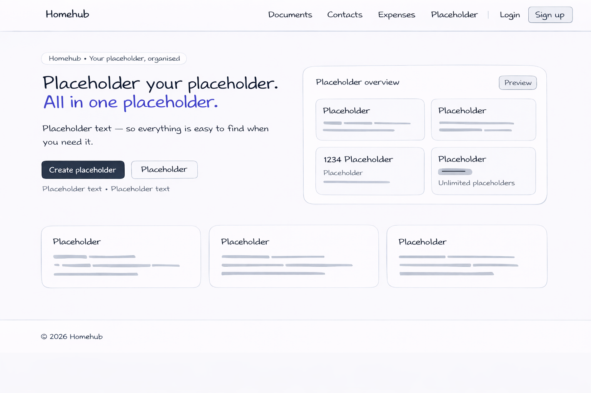
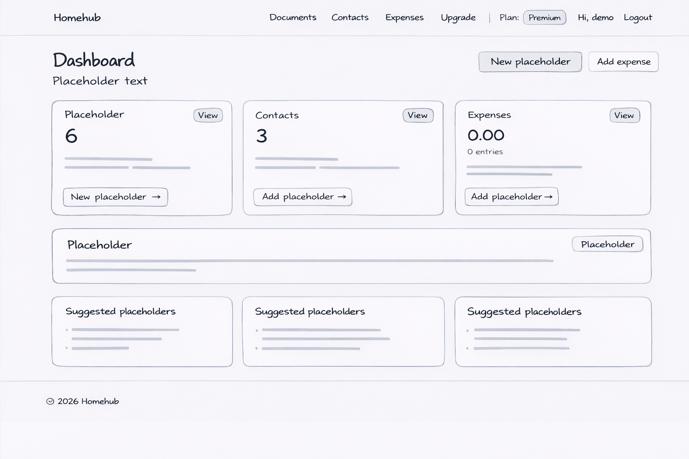
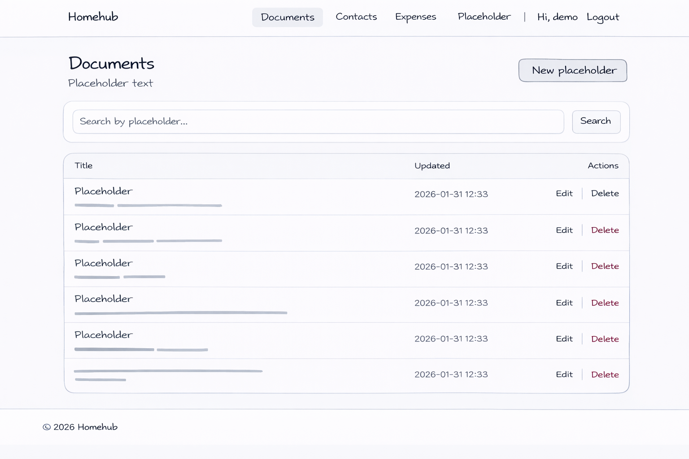
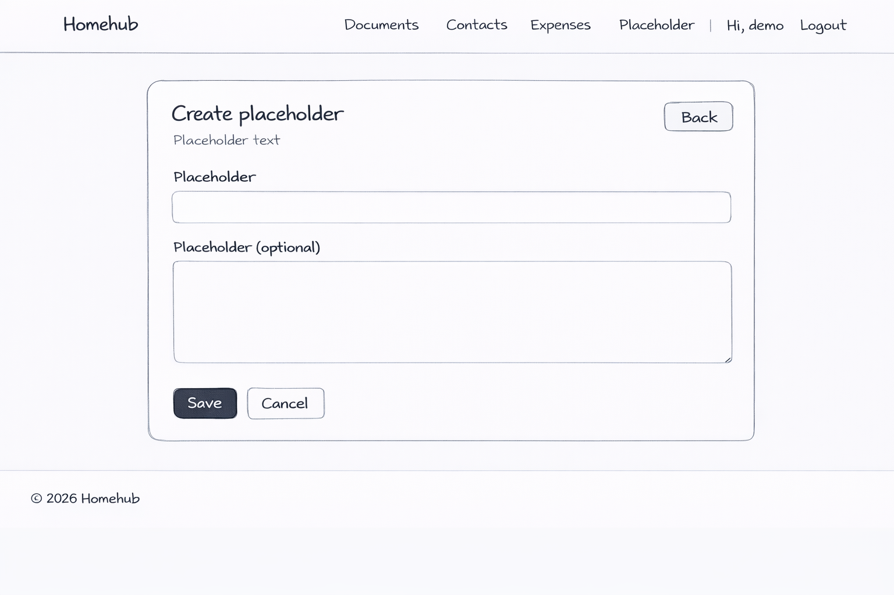

# Homehub 🏡


**Homehub** is a full-stack Django web application designed to help users organize important home information in one place. Users can securely log in to manage **documents**, **contacts**, and **monthly expenses**, and optionally upgrade to **Premium** via Stripe to unlock unlimited document storage.

[Live Demo](https://homehub-anton-5399ce3434e0.herokuapp.com/)


---

## Key Features

- User authentication (registration, login, logout)
- Clean Tailwind UI (Notion-inspired)
- Documents:
  - Create / view / edit / delete
  - Search functionality
  - Free plan document limit (Premium removes the limit)
- Contacts:
  - Store home-related contacts (plumber, electrician, landlord etc.)
  - Full CRUD + search
- Expenses:
  - Monthly expense tracking
  - Month filter + monthly totals
- Payments:
  - Stripe checkout (test mode)
  - Premium status enabled after successful payment
- Feedback messages and confirmation flows
- Responsive design (mobile, tablet, desktop)

## Contents

1. [Features](#features)
2. [User Experience (UX)](#user-experience-ux)
   - [Design Choices](#design-choices)
   - [Typography](#typography)
   - [User Stories](#user-stories)
   - [Wireframes](#wireframes)
3. [Information Architecture](#information-architecture)
   - [Database Schema Diagram](#database-schema-diagram)
4. [Technologies Used](#technologies-used)
5. [Agile Methodology](#agile-methodology)
   - [Kanban Workflow](#kanban-workflow)
   - [Project Evolution](#project-evolution)
6. [Version Control](#version-control)
7. [Deployment](#deployment)
8. [Testing](#testing)
9. [Known Issues and Future Features](#known-issues-and-future-features)
10. [Credits](#credits)
    - [Resources Used](#resources-used)
    - [Code Used](#code-used)
    - [Acknowledgements](#acknowledgements)

---
## Features

### Existing Features

1. **User Registration & Authentication**
   - Secure signup, login, logout
   - User data is private (users can only access their own content)

2. **Documents Management**
   - Add, edit, view, and delete documents
   - Search documents by title and description
   - Free plan document limit (Premium removes the limit)

3. **Contacts Management**
   - Add, edit, and delete contacts
   - Store key household contacts (e.g. electrician, plumber)
   - Search contacts by name, role, or notes

4. **Expenses Tracking**
   - Add, edit, and delete expenses
   - Filter expenses by month
   - Monthly totals displayed clearly

5. **Payments & Subscription**
   - Upgrade to Premium through Stripe Checkout
   - Premium status displayed across the UI
   - Premium removes free plan document limit

6. **Admin Panel**
   - Django admin for user and content management

[Go to Contents](#contents)

---

## Target Audience
- Home owners and renters who want one place for home information.
- Families managing recurring household costs and services.
- Users who want a lightweight “home admin” tool that is easy to use.

---

## User Experience (UX)

### Design Choices

Homehub is designed as a clean digital home organizer with a calm, minimal interface inspired by productivity tools.

#### Color Scheme
- Neutral base with subtle borders and soft backgrounds
- Accent color used for primary actions and navigation focus


#### Typography
- Clean typography for readability (modern sans-serif / Inter-like)
- Clear hierarchy for headings, labels, and helper text

#### User Stories

##### Visitors
- As a visitor, I can view the landing page but cannot access private content.

##### Registered Users
- As a user, I can register an account.
- As a user, I can log in and log out securely.
- As a user, I can create, edit and delete my own documents.
- As a user, I can store key contacts for my household.
- As a user, I can track monthly household expenses.
- As a user, I receive confirmation messages when actions succeed or fail.
- As a user, I can upgrade to Premium to unlock unlimited documents.

##### Admin Users
- As an admin, I can manage users and data via Django admin.

#### Wireframes

<details>
<summary>Landing Page</summary>
<br>


</details>

<details>
<summary>Dashboard</summary>
<br>


</details>

<details>
<summary>Documents</summary>
<br>


</details>

<details>
<summary>Add Documents</summary>
<br>


</details>

<details>
<summary>Mobile View</summary>
<br>


</details>

Wireframes were created using (Visily.ai).

[Go to Contents](#contents)

---

## Information Architecture

### Database Schema Diagram

Homehub uses a user-owned content model:
- Each user can have many documents, contacts, and expenses.
- Each record belongs to one user.
- Premium state is stored in a subscription model linked to the user.

The diagram below illustrates the database structure and relationships used in Homehub.


[Go to Contents](#contents)

---

## Technologies Used

### Languages and Frameworks

- [](https://en.wikipedia.org/wiki/HTML5)
- [](https://tailwindcss.com/)
- [](https://www.javascript.com)
- [](https://www.python.org)
- [](https://www.djangoproject.com/)

### Databases

- [](https://www.postgresql.org/) (production)

### Other Tools

- [](https://git-scm.com)
- [](https://github.com)
- [](https://www.heroku.com)
- [](https://stripe.com/)
- [](https://whitenoise.readthedocs.io)
- [](https://validator.w3.org/)
- [](https://jigsaw.w3.org/css-validator/)
- [](https://jshint.com/)
- [](https://pep8ci.herokuapp.com/)
- [](https://ui.dev/amiresponsive)
- [](https://stackoverflow.com/)

[Go to Contents](#contents)

---

## Agile Methodology

This project was developed using Agile methodology and tracked using GitHub Issues and Projects.

### Kanban Workflow

Development was managed using a GitHub Projects Kanban board with the following workflow stages:

- Backlog
- To Do
- In Progress
- Review / Testing
- Done

The board was used to plan features, track progress, and ensure all core functionality was implemented and tested.

- Kanban Board: https://github.com/users/carlssonanton87/projects/2


### Project Evolution
- Planned epics and user stories first
- Implemented core CRUD functionality
- Added Premium subscription gate (Stripe)
- Iterated UI/UX with Tailwind and responsive improvements
- Deployed to Heroku with auto-deploy from GitHub

[Go to Contents](#contents)

---

## Version Control

For version control, Git was used to track changes through frequent commits:

- `git add .`
- `git commit -m "message"`
- `git push`

[Go to Contents](#contents)

---
## Deployment

This project was deployed to **Heroku**, using **GitHub integration** for automatic deployments. The live application reflects the latest code pushed to the `main` branch.

### Live Application

- **Live site:** https://homehub-anton-5399ce3434e0.herokuapp.com/
- **Repository:** https://github.com/carlssonanton87/homehub

---

### Heroku Deployment Steps

The following steps were taken to deploy the application:

1. **Create Heroku App**
   - Logged in to the Heroku dashboard
   - Clicked **New → Create new app**
   - Selected a unique app name and region

2. **Connect GitHub Repository**
   - Navigated to the **Deploy** tab in Heroku
   - Selected **GitHub** as the deployment method
   - Connected the Homehub repository
   - Enabled **automatic deploys** from the `main` branch

3. **Configure Environment Variables**
   The following environment variables were added under **Settings → Config Vars**:

   - `SECRET_KEY` – Django secret key
   - `DATABASE_URL` – PostgreSQL database URL
   - `STRIPE_SECRET_KEY` – Stripe API secret key
   - `STRIPE_PUBLISHABLE_KEY` – Stripe public key
   - `STRIPE_PRICE_ID` – Stripe subscription price ID
   - `STRIPE_WEBHOOK_SECRET` – Stripe webhook signing secret
   - `DEBUG` – Set to `False` for production

4. **Buildpacks**
   - The **Heroku Python buildpack** was used to run the Django application

5. **Database**
   - PostgreSQL was used as the production database
   - Database migrations were applied automatically during deployment

6. **Static Files**
   - Static files are handled using **WhiteNoise**
   - `collectstatic` runs automatically during deployment

7. **Verify Deployment**
   - The application was launched via the Heroku dashboard
   - User authentication, CRUD functionality, and Stripe payments were tested in production

---

### Local Development Setup

To run the project locally:

1. **Clone the repository**
   ```bash
   git clone https://github.com/carlssonanton87/homehub.git
   cd homehub


2. **Set Up Virtual Environment**:  
   
   - Create a virtual environment:
     ```
     python3 -m venv venv
     ```
   - Activate the virtual environment:
     - On Windows: `venv\Scripts\activate`
     - On macOS and Linux: `source venv/bin/activate`

3. **Install Dependencies**:  
   - With the virtual environment activated, install the required packages:
     ```
     pip install -r requirements.txt
     ```

4. **Set Up Environment Variables**:  
   - Create an `env.py` file in the root directory and add the following environment variables based on `settings.py` requirements:
     ```python
     SECRET_KEY = "your_secret_key"
DATABASE_URL = "your_database_url"
STRIPE_SECRET_KEY = "your_stripe_secret_key"
STRIPE_PUBLISHABLE_KEY = "your_stripe_publishable_key"
STRIPE_PRICE_ID = "your_stripe_price_id"
STRIPE_WEBHOOK_SECRET = "your_stripe_webhook_secret"
DEBUG = True
     ```
   
5. **Apply Migrations**:  
   - Run migrations to set up the database schema:
     ```
     
     python manage.py migrate
     ```


6. **Create superuser**:  
   - Create a superuser (optional):
     ```
     python manage.py createsuperuser
     ```

6. **Run Server**:  
   - Run the development server:
     ```
     python manage.py runserver
     ```
       - Open a browser and go to `http://127.0.0.1:8000/` to view the application locally.


---

[Go to Contents](#contents)

## Testing

Comprehensive testing has been performed to validate functionality, usability, and reliability.

For detailed test cases, validation screenshots, and device testing, please refer to the  
👉 **[TESTING.md](TESTING.md)** file.

[Go to Contents](#contents)


---

## Known Issues and Future Features

### Future Features
- Expense analytics (categories, charts, trends)
- Optional file uploads for documents (Cloudinary/S3)
- Reminders for renewals and home services
- Export expenses to CSV

### Known Issues
- No recurring expense support yet
- No document file upload (text-only documents)

---

## Credits

### Resources Used
- Django Documentation
- Tailwind CSS Documentation
- Stripe Documentation
- Code Institute course material

### Code Used
- Based on Code Institute Django project patterns
- Stripe integration based on official Stripe documentation

### Acknowledgements
- Code Institute
- Mentor feedback
- ChatGPT for troubleshooting and documentation support

---

## Security
- Authentication is required for all user data features.
- Owner-only permissions are enforced by filtering objects by `owner=request.user`.
- Sensitive configuration (SECRET_KEY, Stripe keys) is stored in environment variables.
- Production settings disable DEBUG and use ALLOWED_HOSTS from the environment.
- POST is used for logout and payments to reduce CSRF risk.


---


