# 🧪 Testing - Homehub

This document outlines the testing strategy for the Homehub Django project.

> [!NOTE]
> Return back to the [README.md](README.md) file

---

## Content Table

1. [Manual Testing](#manual-testing)
   - [User Management](#user-management)
   - [Dashboard](#dashboard)
   - [Documents](#documents)
   - [Contacts](#contacts)
   - [Expenses](#expenses)
   - [Payments & Subscription](#payments--subscription)
   - [Security & Access Control](#security--access-control)
   - [Feedback & Confirmation](#feedback--confirmation)
2. [Automated Testing](#automated-testing)
   - [Python Unit Tests](#python-unit-tests)
   - [What is Tested](#what-is-tested)
4. [Browser Compatibility](#browser-compatibility)
7. [Responsiveness](#responsiveness)
9. [Device Testing](#device-testing)
5. [HTML Testing](#html-testing)
6. [CSS Testing](#css-testing)
7. [JavaScript Testing](#javascript-testing)
7. [Lighthouse Testing](#lighthouse-testing)
7. [PEP8 Testing](#pep8-testing)
6. [TODO (Future)](#todo-future)

---

## 👤 Manual Testing

### User Management

#### US01: As a user, I want to register and log in securely, so I can manage my home data.

| **Test Scenario ID** | **Test Scenario**               | **Steps to Test**                                         | **Expected Result**                                                | **Pass/Fail** | **Screenshots** |
| -------------------- | -------------------------------- | --------------------------------------------------------- | ------------------------------------------------------------------ | ------------- | --------------- |
| UM-TS01              | Signup page loads                | Visit `/accounts/signup/`                                 | Signup form loads with correct fields and styling                  | Pass          | 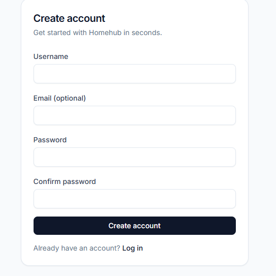 |
| UM-TS02              | Successful registration          | Submit valid signup form                                  | User created and redirected to dashboard (or login)                | Pass          | 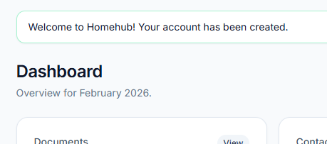 |
| UM-TS03              | Duplicate username validation    | Attempt signup with an existing username                  | Form shows validation error                                        | Pass          | 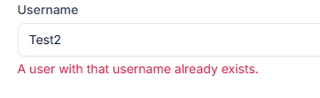 |
| UM-TS04              | Password strength validation     | Enter a weak password                                     | Validation error shown                                             | Pass          | 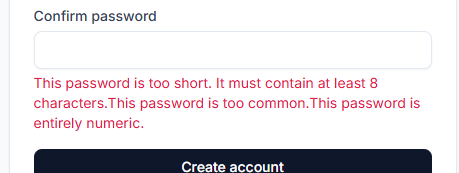 |
| UM-TS05              | Login page loads                 | Visit `/accounts/login/`                                  | Login form loads correctly                                         | Pass          | 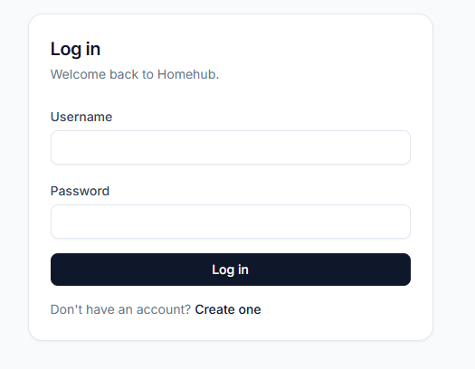 |
| UM-TS06              | Successful login                 | Login with valid credentials                              | User redirected to dashboard                                       | Pass          | 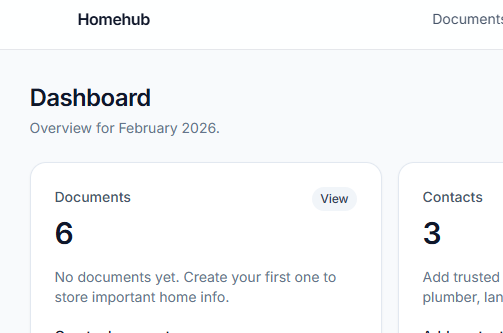 |
| UM-TS07              | Invalid login                    | Login with wrong credentials                              | Error message shown, user stays unauthenticated                    | Pass          | 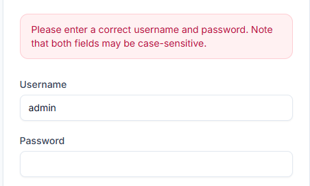 |
| UM-TS08              | Logout uses POST                 | Click logout in navbar                                    | User logged out successfully (no 405 error)                        | Pass          | 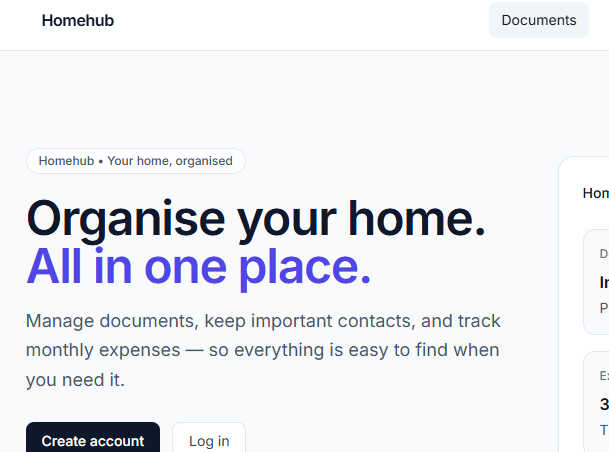 |
| UM-TS09              | Auth required for private pages  | Log out and visit `/documents/`, `/contacts/`, `/expenses/`| Redirected to login                                                | Pass          | 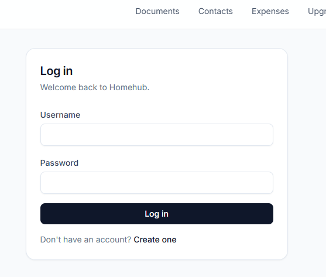 |
| UM-TS10              | Accessibility of auth forms      | Use keyboard only across login/signup                     | Focus visible, labels present, errors readable                     | Pass          | 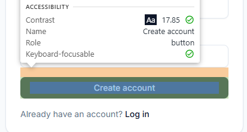 |

---

## Dashboard

#### US02: As a user, I want an overview of my home data, so I can quickly navigate and understand my status.

| **Test Scenario ID** | **Test Scenario**           | **Steps to Test**                              | **Expected Result**                                              | **Pass/Fail** | **Screenshots** |
| -------------------- | --------------------------- | ---------------------------------------------- | ---------------------------------------------------------------- | ------------- | --------------- |
| DB-TS01              | Dashboard loads             | Login and go to `/` / `/dashboard/`            | Dashboard renders with cards and navigation                       | Pass          | 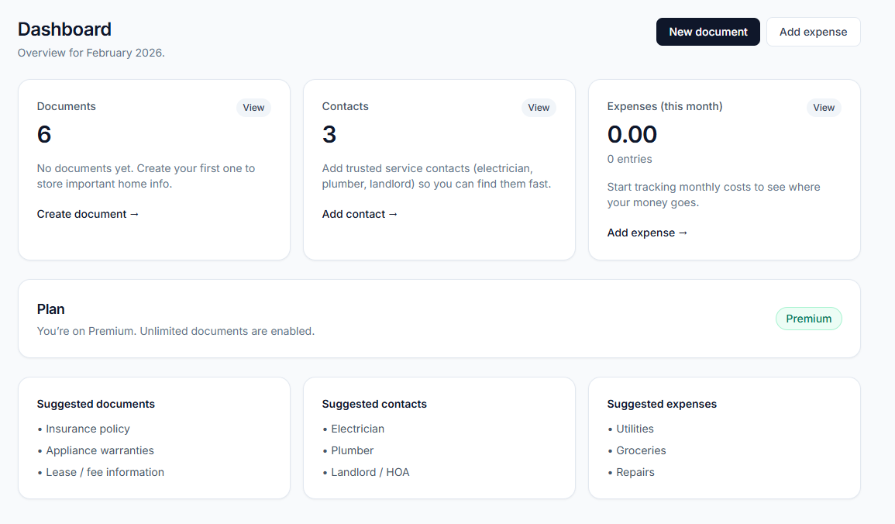 |
| DB-TS02              | Card links work             | Click Documents/Contacts/Expenses cards         | Navigates to correct list pages                                   | Pass          | 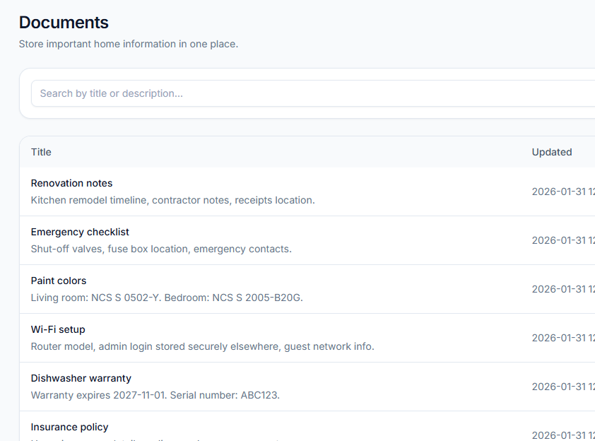 |
| DB-TS03              | Empty states display        | Login with a new user (no data)                 | Helpful empty states shown                                        | Pass          | 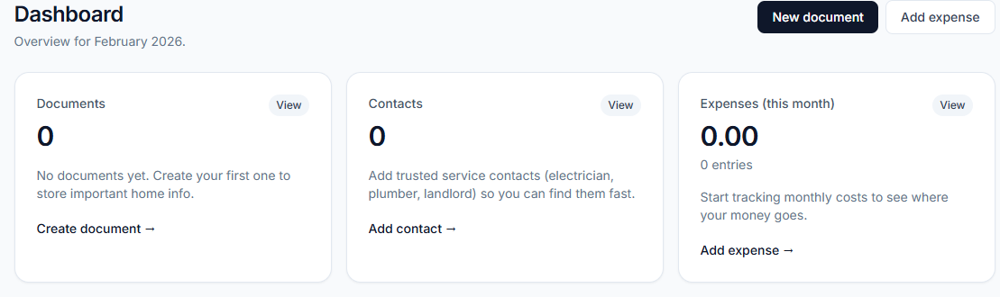 |
| DB-TS04              | Plan status shown           | View dashboard as Free and Premium              | Correct plan badge and copy displayed                             | Pass          | 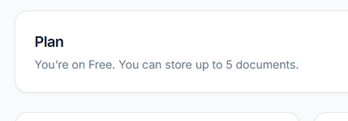 |
| DB-TS05              | Expense total formatting    | View monthly totals                             | Totals formatted consistently (money formatting)                  | Pass          | 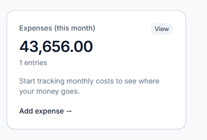 |
| DB-TS06              | Responsive dashboard        | Resize / test on mobile                         | Layout stacks properly, no overflow                               | Pass          | 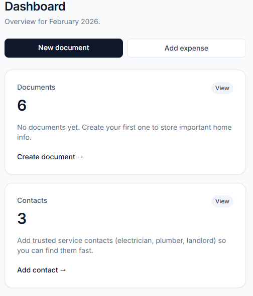 |

---

## Documents

#### US03: As a user, I want to create and manage documents, so I can store important home information.  
#### US04: As a Free user, I want a limit on documents, and as Premium I want unlimited documents.

| **Test Scenario ID** | **Test Scenario**              | **Steps to Test**                                                      | **Expected Result**                                                     | **Pass/Fail** | **Screenshots** |
| -------------------- | ------------------------------ | ---------------------------------------------------------------------- | ----------------------------------------------------------------------- | ------------- | --------------- |
| DOC-TS01             | Documents list loads           | Visit `/documents/`                                                     | List loads with search and responsive table/cards                        | Pass          | 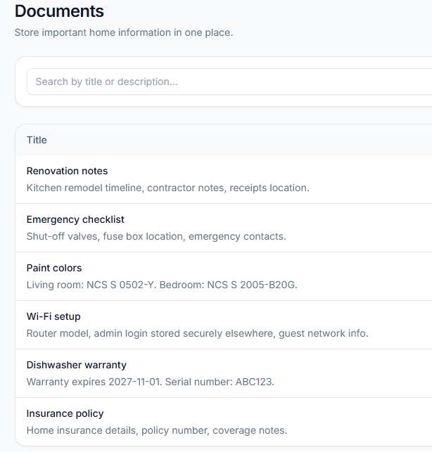 |
| DOC-TS02             | Create document (valid)        | New document → submit valid title + description                         | Document created, success message shown                                 | Pass          | 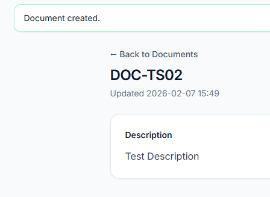 |
| DOC-TS03             | Create document (validation)   | Submit without title                                                    | Validation error shown                                                   | Pass          | 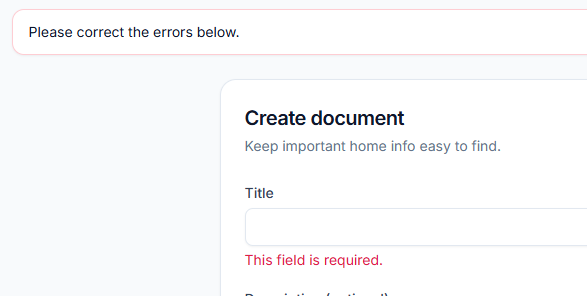 |
| DOC-TS04             | Document detail page           | Open any document                                                       | Detail shows title, description, updated timestamp                       | Pass          | 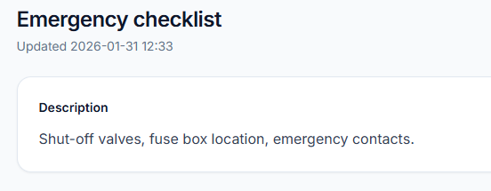 |
| DOC-TS05             | Edit document                  | Edit a document and save                                                | Changes persist                                                         | Pass          | 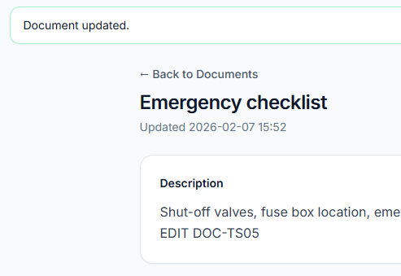 |
| DOC-TS06             | Delete with confirmation       | Delete document → confirm                                                | Document removed, success message shown                                 | Pass          | 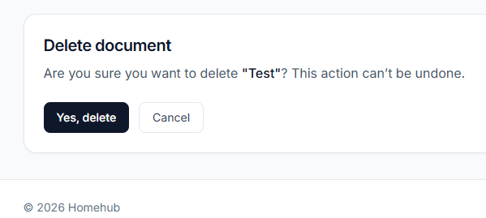 |
| DOC-TS07             | Search documents               | Search with `?q=`                                                       | Results filtered correctly                                               | Pass          | 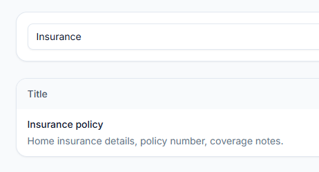 |
| DOC-TS08             | Free plan limit enforced       | Create documents until limit reached (Free)                              | Creation blocked with guidance to upgrade                                | Pass          | 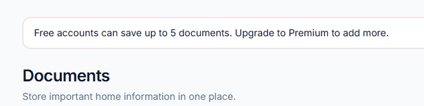 |
| DOC-TS09             | Premium bypasses doc limit     | As Premium, create beyond Free limit                                    | Creation allowed                                                        | Pass          | 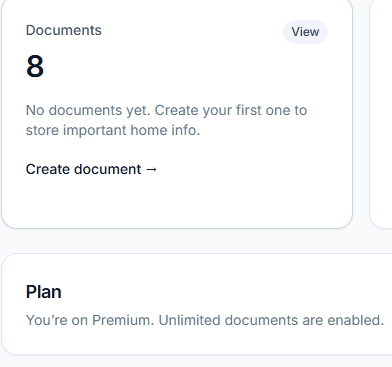 |

---

## Contacts

#### US05: As a user, I want to store key contacts, so I can find them quickly.

| **Test Scenario ID** | **Test Scenario**            | **Steps to Test**                                           | **Expected Result**                                         | **Pass/Fail** | **Screenshots** |
| -------------------- | ---------------------------- | ----------------------------------------------------------- | ----------------------------------------------------------- | ------------- | --------------- |
| CON-TS01             | Contacts list loads          | Visit `/contacts/`                                          | List loads with search and responsive table/cards            | Pass          | 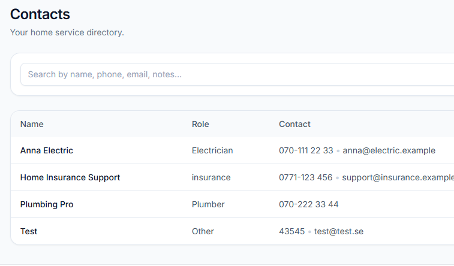 |
| CON-TS02             | Create contact (valid)       | Add contact with valid details                              | Contact created, success message shown                      | Pass          | 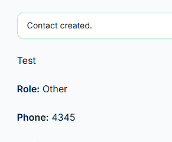 |
| CON-TS03             | Create contact (validation)  | Submit without name                                         | Validation error shown                                      | Pass          | 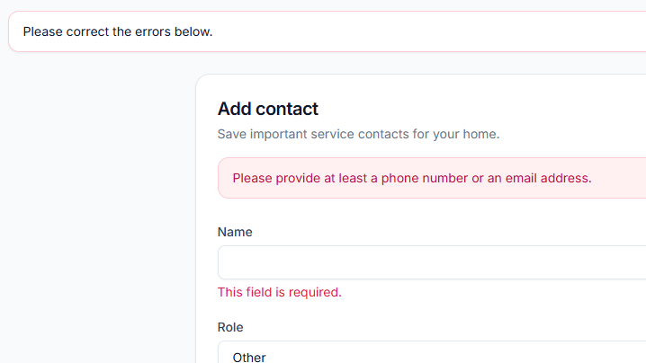 |
| CON-TS04             | Contact detail page          | Open any contact                                            | Detail shows role, phone/email, notes                       | Pass          | 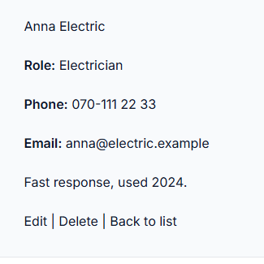 |
| CON-TS05             | Edit contact                 | Edit contact and save                                       | Changes persist                                             | Pass          | 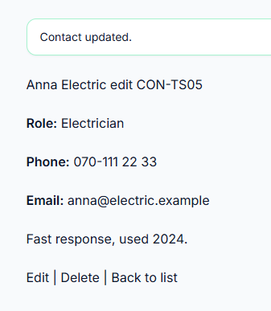 |
| CON-TS06             | Delete contact confirmation  | Delete contact → confirm                                    | Contact removed, success message shown                      | Pass          | 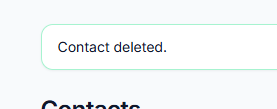 |
| CON-TS07             | Search contacts              | Search with `?q=`                                           | Results filtered correctly                                   | Pass          | 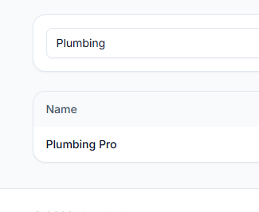 |

---

## Expenses

#### US06: As a user, I want to track monthly expenses, so I can understand household spending.

| **Test Scenario ID** | **Test Scenario**            | **Steps to Test**                                                     | **Expected Result**                                               | **Pass/Fail** | **Screenshots** |
| -------------------- | ---------------------------- | --------------------------------------------------------------------- | ----------------------------------------------------------------- | ------------- | --------------- |
| EXP-TS01             | Expenses list loads          | Visit `/expenses/`                                                     | List loads with month picker and totals                            | Pass          | 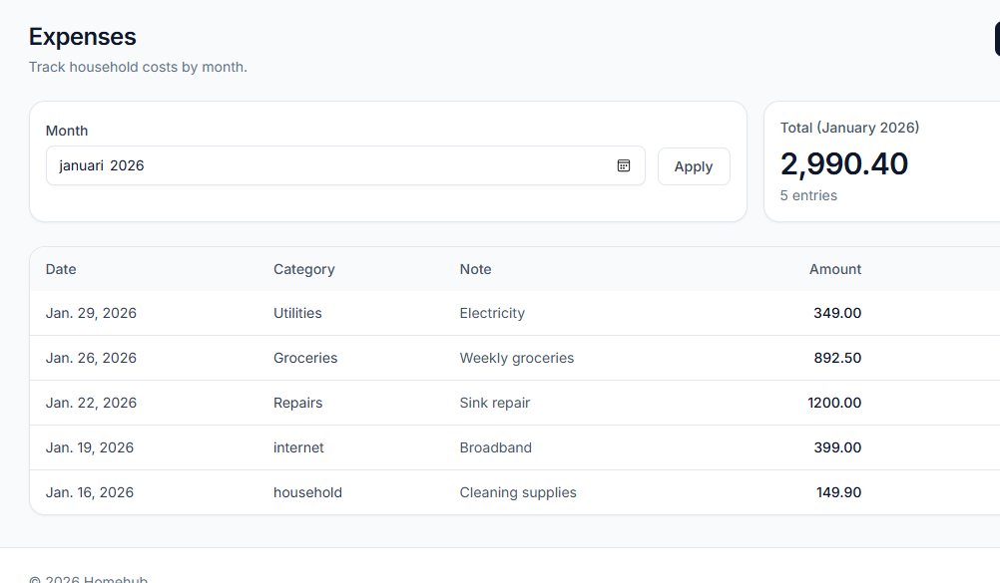 |
| EXP-TS02             | Add expense (valid)          | Add expense with valid date/category/amount                           | Expense created, success message shown                             | Pass          | 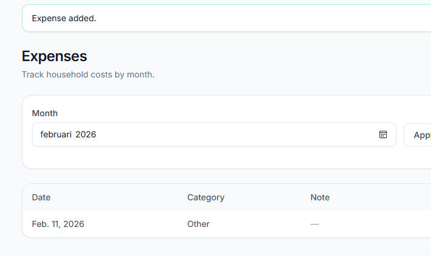 |
| EXP-TS03             | Add expense (validation)     | Submit with missing/invalid fields                                    | Validation errors shown                                            | Pass          |  |
| EXP-TS04             | Month filter works           | Select month using `<input type="month">`                              | List/totals update to selected month                               | Pass          | 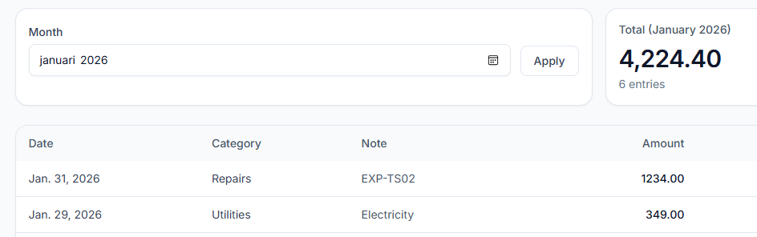 |
| EXP-TS05             | Edit expense                 | Edit expense and save                                                  | Changes persist                                                    | Pass          |  |
| EXP-TS06             | Delete expense confirmation  | Delete expense → confirm                                               | Expense removed, success message shown                             | Pass          | 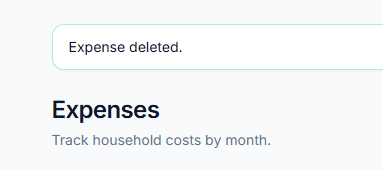 |
| EXP-TS07             | Amount formatting            | View amounts in list and totals                                        | Amounts formatted consistently (money filter)                      | Pass          | 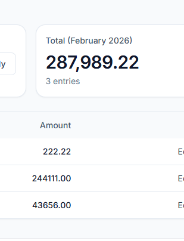 |
| EXP-TS08             | Mobile usability             | View expenses page on mobile                                           | Cards stack, actions usable                                        | Pass          | 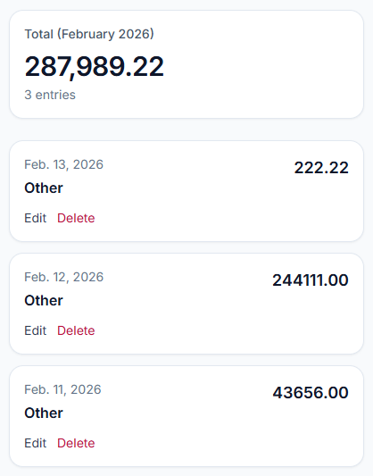 |

---

## Payments & Subscription

#### US07: As a user, I want to upgrade to Premium, so I can unlock unlimited documents.

| **Test Scenario ID** | **Test Scenario**                         | **Steps to Test**                                  | **Expected Result**                                              | **Pass/Fail** | **Screenshots** |
| -------------------- | ----------------------------------------- | -------------------------------------------------- | ---------------------------------------------------------------- | ------------- | --------------- |
| PAY-TS01             | Upgrade page loads                         | Visit `/payments/upgrade/`                         | Upgrade info displayed with correct CTA                           | Pass          | 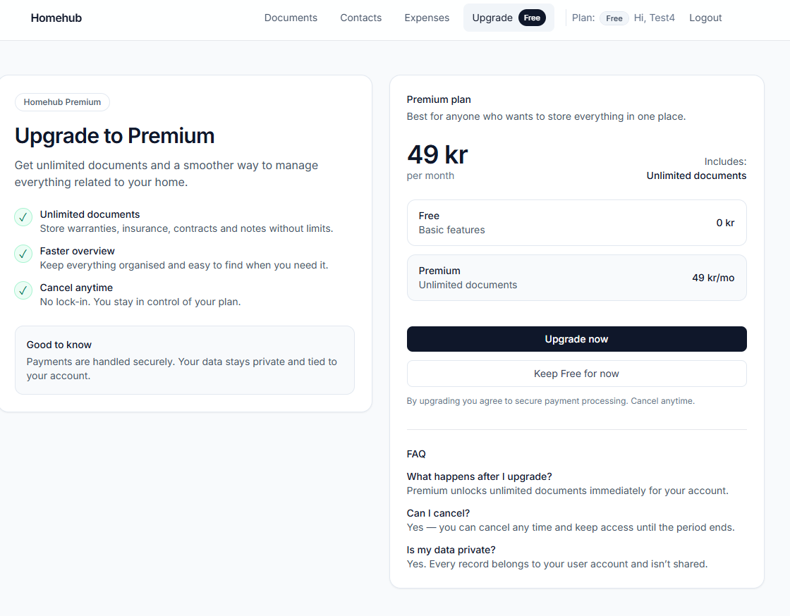 |
| PAY-TS02             | Start checkout (Stripe test mode)          | Click upgrade button                               | Redirects to Stripe checkout                                      | Pass          | 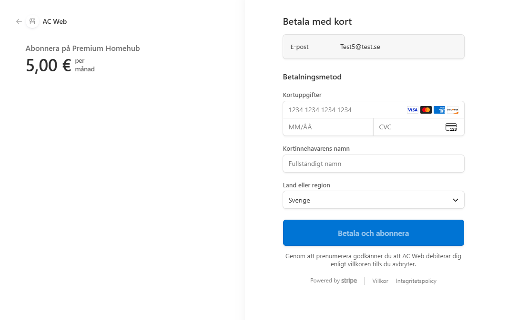 |
| PAY-TS03             | Successful payment → Premium               | Complete test payment and return to app            | Success page; user marked Premium                                 | Pass          | 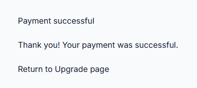 |
| PAY-TS04             | Cancel checkout                             | Cancel in Stripe checkout                          | Redirect to cancel page with messaging                             | Pass          | 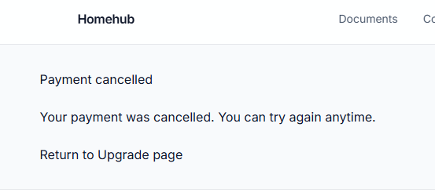 |
| PAY-TS05             | Premium badge visible                       | Check dashboard/navbar after success               | “Premium” is displayed                                             | Pass          | 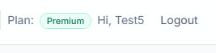 |
| PAY-TS06             | Free limit removed after upgrade            | Create > 5 documents after upgrade                 | Unlimited documents allowed                                        | Pass          | 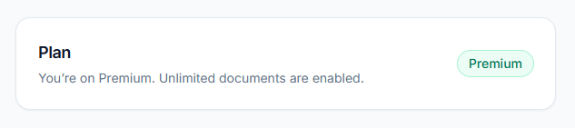 |

---

## Security & Access Control

#### US08: As a user, I want my data isolated, so other users cannot access my documents, contacts, or expenses.

| **Test Scenario ID** | **Test Scenario**        | **Steps to Test**                                                       | **Expected Result**                           | **Pass/Fail** | **Screenshots** |
| -------------------- | ------------------------ | ----------------------------------------------------------------------- | --------------------------------------------- | ------------- | --------------- |
| SEC-TS01             | Documents isolation      | User B tries to open User A document detail URL                         | 404 / Not found                              | Pass          |  |
| SEC-TS02             | Contacts isolation       | User B tries to edit/delete User A contact via URL                      | 404 / Not found                              | Pass          | 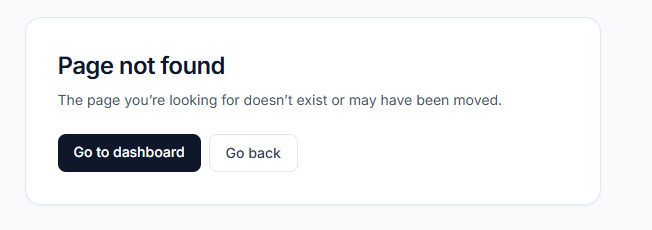 |
| SEC-TS03             | Expenses isolation       | User B tries to delete User A expense via URL                           | 404 / Not found                              | Pass          |  |
| SEC-TS04             | CSRF on POST forms       | Check forms contain `` and POST submits succeed          | CSRF tokens present; invalid requests rejected| Pass          | 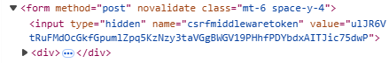 |
| SEC-TS05             | Logout requires POST     | Attempt GET logout directly (if route exists)                           | Logout not triggered; logout works via button | Pass          | 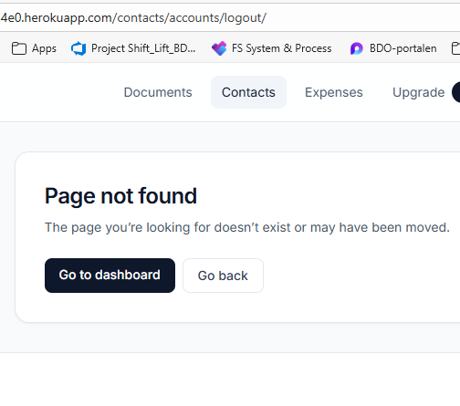 |

---

## Feedback & Confirmation

#### US09: As a user, I want confirmation messages when actions succeed or fail.

| **Test Scenario ID** | **Test Scenario**                     | **Steps to Test**                               | **Expected Result**                                  | **Pass/Fail** | **Screenshots** |
| -------------------- | ------------------------------------- | ----------------------------------------------- | ---------------------------------------------------- | ------------- | --------------- |
| FC-TS01              | Success message on create             | Create document/contact/expense                 | Success message displayed                             | Pass          | 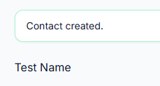 |
| FC-TS02              | Success message on edit               | Edit document/contact/expense                   | Success message displayed                             | Pass          | 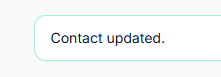 |
| FC-TS03              | Success message on delete             | Delete document/contact/expense                 | Success message displayed                             | Pass          |  |
| FC-TS04              | Errors shown on invalid form          | Submit form with invalid fields                 | Field errors displayed                                 | Pass          | 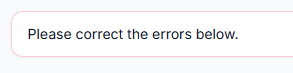 |
| FC-TS05              | Delete confirmation prevents mistakes | Open delete page and cancel                      | Object remains; safe navigation                        | Pass          |  |

---

## Automated Testing

### Python Unit Tests

Homehub uses Django’s built-in test framework (`TestCase`) for automated tests.

### ✅ To run tests:

python manage.py test

### ✅ What is Tested

### ✅ What is Tested

The following automated tests were written using Django’s built-in `TestCase` framework. These tests focus on authentication, access control, document ownership, and subscription defaults.

| **Test File** | **Test Name** | **Purpose** |
|---|---|---|
| `accounts/tests.py` | `test_user_can_signup` | Verifies that a user can sign up successfully and is redirected to the home page after registration. |
| `accounts/tests.py` | `test_login_required_redirect` | Ensures protected pages (e.g. documents list) redirect unauthenticated users to the login page. |
| `documents/tests.py` | `test_logged_in_user_can_create_document` | Confirms a logged-in user can create a document and that it is assigned to the correct owner. |
| `documents/tests.py` | `test_document_list_shows_only_own_documents` | Ensures the documents list only shows documents belonging to the logged-in user. |
| `documents/tests.py` | `test_owner_can_view_delete_confirm_page` | Confirms the document owner can access the delete confirmation page. |
| `documents/tests.py` | `test_owner_can_delete_document_via_post` | Ensures the document owner can delete a document via POST and that it is removed from the database. |
| `documents/tests.py` | `test_user_cannot_view_or_delete_another_users_document` | Prevents URL tampering by ensuring users cannot view/delete documents they do not own. |
| `payments/tests.py` | `test_subscription_created_for_new_user` | Ensures a `Subscription` object is automatically created for new users and defaults to `is_premium = False`. |

## 🧪 Optional: Run with coverage
pip install coverage

coverage run manage.py test

coverage report

---
---

## 🖥️ Browser Compatibility

Tested manually on:

- Chrome (latest)
- Firefox (latest)
- Safari (Mac)
- Edge

All layouts tested on mobile and desktop screens (responsive design).

---

### Responsiveness

The entire project UI is built with **Tailwind CSS**, using responsive utility classes and a mobile-first layout. Pages were tested to ensure consistent spacing, readable typography, and usable navigation on small screens.

#### Responsive Design Testing

- Tested on various devices and screen sizes to ensure optimal user experience.
- Used **Chrome DevTools** to emulate different devices and screen resolutions.
- Performed physical testing on multiple smartphone sizes where available.
- Verified layout and functionality across mobile, tablet, and desktop views.

Key highlights:
- **Mobile-first layout**: pages stack naturally and remain readable.
- **Responsive components**: tables transform into mobile-friendly cards.
- **Navigation UX**: hamburger menu supports smaller screens.

---

## Device Testing

The project was tested on various devices to ensure seamless responsiveness and user experience:

| **Devices** | **Landing / Login** | **Dashboard** | **Documents** | **Contacts** | **Expenses** | **Notes** |
|-------------|----------------------|---------------|---------------|--------------|--------------|----------|
|  |  |  |  |  |  | Fully responsive |
|  |  |  |  |  |  | Fully responsive |
|  |  |  |  |  |  | Fully responsive |

---

## Code Validation

### HTML Testing

I have validated all HTML files using the recommended [HTML W3C Validator](https://validator.w3.org) to ensure they meet current web standards and best practices.

### CSS Testing

The project uses **Tailwind CSS** for styling (via CDN). Any custom CSS (if present) was validated using the recommended [CSS jigsaw Validator](https://jigsaw.w3.org/css-validator/).

### JavaScript Testing

In this project, I utilized **JavaScript** for minimal UI behaviour (navbar menu toggle).

To ensure code quality and adherence to best practices, I validated custom JavaScript using the recommended [JSHint Validator](https://jshint.com).

| **Script Type** | **Validation Screenshot**  | **Comments** |
|-----------------|----------------------------|--------------|
| `javaScript Code` |  | Navbar toggle JS validation |

---

## Lighthouse Testing

Lighthouse was utilized to evaluate the **performance**, **accessibility**, **best practices**, and **SEO** of the Homehub application.

#### Testing Overview

- Tests were conducted for both **desktop**, **tablet** and **mobile** views.
- Performance scores may vary between device profiles due to network throttling in Lighthouse.

---

## Python (PEP8) Validation

### PEP8 Testing

At the end of the project, all Python files were validated to ensure adherence to PEP8 standards. The following tools were used:

- **Black**: To ensure consistent and readable code style across the project, I used [Black](https://pypi.org/project/black//), the uncompromising Python code formatter. Black automatically reformats all Python files according to a strict and widely-accepted standard, eliminating style debates and making the codebase easier to maintain and review. The entire project was formatted using Black before final submission.

This final validation step ensured that the code meets industry-standard best practices for readability and maintainability.

- **PEP8 CI Python Linter**: Custom Python files were validated using the [Code Institute PEP8 Validator](https://pep8ci.herokuapp.com/) to ensure compliance with PEP8 guidelines.

**Results:**  
All tested Python files passed validation checks, confirming compliance with PEP8 standards.

| **Directory Name** | **File Name** | **Validation Screenshot**  | **Comments** |
|--------------------|---------------|----------------------------|--------------|
| `Project Level` | `manage.py` |  | Passed with no issues |
| `Project Folder` | `settings.py` |  | Formatting issues resolved |
| `Project Folder` | `urls.py` |  | Code adjusted for line-length compliance |
| `Core App` | `views.py` |  | Passed with no issues |
| `Documents App` | `models.py` |  | Passed with no issues |
| `Contacts App` | `models.py` |  | Passed with no issues |
| `Expenses App` | `models.py` |  | Passed with no issues |
| `Payments App` | `views.py` |  | Passed with no issues |

---

## 🧹 TODO (Future)

- Add more automated tests (forms, views, integration tests)
- Add CI pipeline (GitHub Actions) to run tests on push
- Add accessibility audit notes (contrast checks, keyboard-only walkthrough)
- Add performance optimizations (build Tailwind locally instead of CDN, asset caching)
